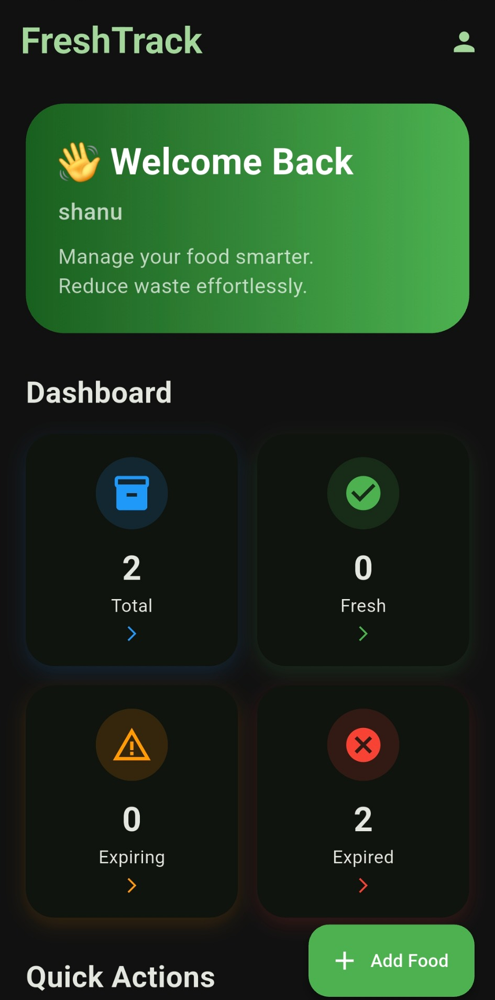
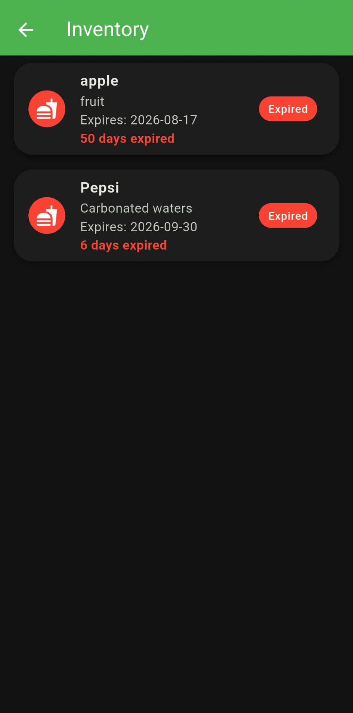
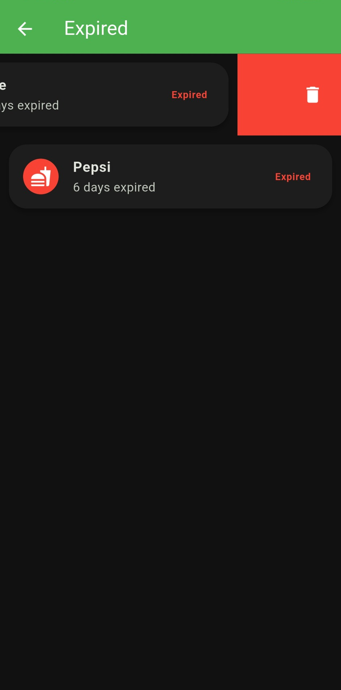

# FreshTrack

### Smart Food Inventory & Expiry Tracking App

FreshTrack is a Flutter-based food inventory management application designed to help users track stored food, monitor expiry dates, reduce food waste, and discover recipe ideas from available ingredients.

The application combines **Flutter, Firebase, food scanning, expiry monitoring, notifications, analytics, and Google Gemini AI** into one practical food-management solution.

---

## ✨ Features

### 📦 Food Inventory

- Add and manage food items
- Edit existing food details
- View the complete food inventory
- Track food status based on expiry dates
- Organize food information in one place

### ⏳ Expiry Tracking

- Monitor food expiry dates
- Identify fresh, expiring, and expired items
- Dedicated food-status screen
- Automatic expiry checking
- Helps users consume food before it goes to waste

### 🔔 Expiry Alerts

- Notifications for important expiry events
- Dedicated alerts screen
- Helps users stay aware of food that needs attention

### 📷 Food Scanning

- Scan food and product information
- Product information service
- Dedicated scanning screens
- Simplifies the process of adding food items

### 🤖 AI-Powered Recipe Assistance

- Generate recipe ideas from available ingredients
- Google Gemini AI integration
- Dedicated recipe screen
- Recipe service and local recipe database

### 📊 Analytics

- View food inventory information
- Monitor food status
- Track inventory-related information through the analytics screen

### 👤 User Authentication

- User registration
- User login
- User profile
- Firebase-based authentication

### 🔥 Firebase Integration

- Firebase Authentication
- Cloud Firestore
- User-specific food data
- Firebase project configuration

---

## 📱 Screenshots

<p align="center">
  
  
  
</p>

<p align="center">
  <strong>Home Dashboard</strong>
  &nbsp;&nbsp;&nbsp;&nbsp;
  <strong>Food Inventory</strong>
  &nbsp;&nbsp;&nbsp;&nbsp;
  <strong>Expiry Tracking</strong>
</p>

---

## 🛠️ Tech Stack

| Technology | Purpose |
|------------|---------|
| Flutter | Cross-platform mobile application |
| Dart | Application programming language |
| Firebase Authentication | User authentication |
| Cloud Firestore | Cloud database |
| Google Gemini AI | AI-powered recipe assistance |
| Local Notifications | Food expiry alerts |
| Product Scanning | Food and product identification |
| Material UI | Application interface |

---

## 🏗️ Project Structure

```text
lib/
│
├── models/
│   └── recipe_model.dart
│
├── screens/
│   ├── add_food_screen.dart
│   ├── alerts_screen.dart
│   ├── analytics_screen.dart
│   ├── edit_food_screen.dart
│   ├── food_status_screen.dart
│   ├── home_screen.dart
│   ├── inventory_screen.dart
│   ├── login_screen.dart
│   ├── profile_screen.dart
│   ├── recipe_screen.dart
│   ├── scan_screen.dart
│   ├── scanner_screen.dart
│   ├── signup_screen.dart
│   └── splash_screen.dart
│
├── services/
│   ├── expiry_checker.dart
│   ├── firestore_service.dart
│   ├── gemini_service.dart
│   ├── notification_service.dart
│   ├── product_service.dart
│   ├── recipe_database.dart
│   └── recipe_service.dart
│
├── firebase_options.dart
└── main.dart
